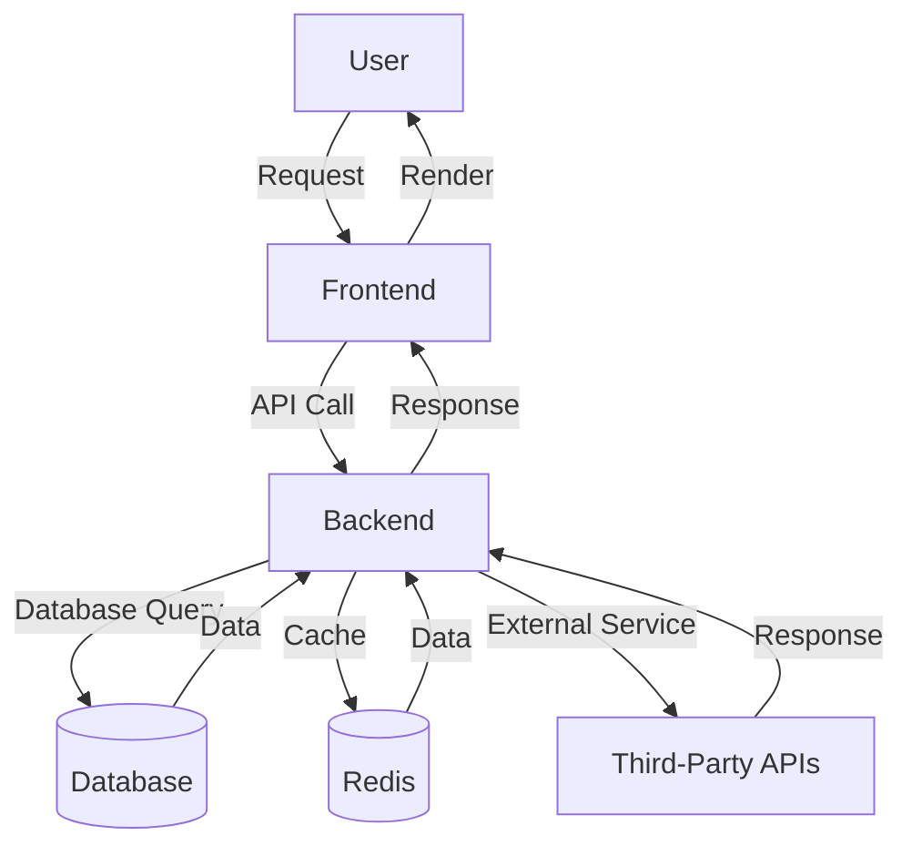

# Rezio Backend Project

This repository contains the backend for the Rezio project. Below you'll find an overview of the project structure and a Mermaid diagram to visualize the architecture.

## Project Structure

```plaintext
pythonProject/
├── .venv/
├── rezio-backend/
│   ├── .github/
│   │   └── workflows/
│   │       └── main.yml
│   ├── compose/
│   │   ├── local/
│   │   │   ├── django/
│   │   │   │   ├── Dockerfile
│   │   │   │   ├── entrypoint
│   │   │   │   └── start
│   │   ├── production/
│   │   │   ├── aws/
│   │   │   ├── maintenance/
│   │   │   │   ├── download
│   │   │   │   └── upload
│   │   │   ├── Dockerfile
│   │   │   ├── django/
│   │   │   │   ├── Dockerfile
│   │   │   │   ├── entrypoint
│   │   │   │   └── start
│   │   │   ├── nginx/
│   │   │   │   ├── Dockerfile
│   │   │   │   ├── nginx.conf
│   │   │   │   └── rezio.conf
│   │   │   ├── postgres/
│   │   │   └── maintenance/
│   │   │       └── _sourced/
│   │   │           ├── constants.sh
│   │   │           ├── countdown.sh
│   │   │           ├── messages.sh
│   │   │           └── yes_no.sh
│   │   ├── backup/
│   │   │   ├── backups/
│   │   │   └── restore/
│   │   │       └── Dockerfile
│   ├── rezio/
│   │   ├── analytics/
│   │   │   ├── migrations/
│   │   │   │   ├── __init__.py
│   │   │   ├── __init__.py
│   │   │   ├── admin.py
│   │   │   ├── apps.py
│   │   │   ├── models.py
│   │   │   ├── tests.py
│   │   │   └── views.py
│   │   ├── firebase/
│   │   │   ├── migrations/
│   │   │   │   ├── __init__.py
│   │   │   ├── __init__.py
│   │   │   ├── admin.py
│   │   │   ├── apps.py
│   │   │   ├── models.py
│   │   │   ├── tests.py
│   │   │   └── views.py
│   │   ├── notifications/
│   │   │   ├── migrations/
│   │   │   │   ├── __init__.py
│   │   │   ├── __init__.py
│   │   │   ├── admin.py
│   │   │   ├── apps.py
│   │   │   ├── models.py
│   │   │   ├── tests.py
│   │   │   └── views.py
│   │   ├── properties/
│   │   │   ├── migrations/
│   │   │   │   ├── __init__.py
│   │   │   ├── __init__.py
│   │   │   ├── admin.py
│   │   │   ├── apps.py
│   │   │   ├── models.py
│   │   │   ├── tests.py
│   │   │   └── views.py
│   │   ├── property_integrations/
│   │   │   ├── migrations/
│   │   │   │   ├── __init__.py
│   │   │   ├── models/
│   │   │   │   ├── __init__.py
│   │   │   │   ├── dubai_pulse.py
│   │   │   │   └── property_monitor.py
│   │   │   ├── serializers/
│   │   │   │   ├── __init__.py
│   │   │   │   ├── dubai_pulse.py
│   │   │   │   └── property_monitor.py
│   │   │   ├── services/
│   │   │   │   ├── __init__.py
│   │   │   │   ├── dubai_pulse.py
│   │   │   │   └── property_monitor.py
│   │   │   ├── views/
│   │   │   │   ├── __init__.py
│   │   │   │   ├── admin.py
│   │   │   │   ├── apps.py
│   │   │   │   ├── tests.py
│   │   │   │   ├── urls.py
│   │   │   │   └── utils.py
│   │   ├── rezio/
│   │   │   ├── __init__.py
│   │   │   ├── asgi.py
│   │   │   ├── settings.py
│   │   │   ├── urls.py
│   │   │   └── wsgi.py
│   │   ├── user/
│   │   │   ├── migrations/
│   │   │   │   ├── 0001_initial.py
│   │   │   │   ├── 0002_investortype_investorprofile.py
│   │   │   │   ├── 0003_agentprofile.py
│   │   │   │   ├── 0004_remove_agentprofile_agency_name_and_more.py
│   │   │   │   ├── 0005_onboardingquestion_onboardinganswer.py
│   │   │   │   ├── 0006_agency_data_source_agent.py
│   │   │   │   ├── 0007_add_default_agent_data_in_db.py
│   │   │   │   ├── 0008_alter_agentprofile_license_end_date_and_more.py
│   │   │   │   ├── 0009_alter_agentprofile_gender_and_more.py
│   │   │   │   ├── __init__.py
│   │   │   ├── permissions/
│   │   │   │   ├── __init__.py
│   │   │   │   ├── agent.py
│   │   │   │   └── investor.py
│   │   │   ├── questions/
│   │   │   │   ├── __init__.py
│   │   │   │   ├── agent_questions.py
│   │   │   │   ├── buy_only.py
│   │   │   │   ├── buyer_and_seller.py
│   │   │   │   ├── common_investor.py
│   │   │   │   ├── generate_questions.py
│   │   │   │   └── sell_only.py
│   │   │   ├── serializers/
│   │   │   │   ├── __init__.py
│   │   │   │   ├── agent.py
│   │   │   │   ├── commons.py
│   │   │   │   └── investor.py
│   │   │   ├── views/
│   │   │   │   ├── __init__.py
│   │   │   │   ├── admin.py
│   │   │   │   ├── apps.py
│   │   │   │   ├── authentication.py
│   │   │   │   ├── constants.py
│   │   │   │   ├── managers.py
│   │   │   │   ├── models.py
│   │   │   │   ├── tests.py
│   │   │   │   ├── text_choices.py
│   │   │   │   ├── urls.py
│   │   │   │   └── utils.py
│   │   ├── utils/
│   │   │   ├── constants.py
│   │   │   ├── custom_exceptions.py
│   │   │   ├── decorators.py
│   │   │   ├── error_utils.py
│   │   │   ├── exception_handler.py
│   │   │   ├── message_utils.py
│   │   │   └── validator_utils.py
│   ├── scripts/
│   ├── static/
│   ├── .dockerignore
│   ├── .gitignore
│   ├── Dockerfile
│   ├── local.yml
│   ├── Makefile
│   ├── production.yml
│   ├── README.md
│   ├── requirements.txt
│   └── sample_env

 ```                        

## Architecture Overview



## Getting Started

### Prerequisites

- Python 3.8+
- Docker
- Docker Compose

### Installation

1. Clone the repository:
    ```bash
    git clone https://github.com/yourusername/rezio-backend.git
    cd rezio-backend
    ```

2. Create and activate a virtual environment:
    ```bash
    python3 -m venv .venv
    source .venv/bin/activate
    ```

3. Install the required dependencies:
    ```bash
    pip install -r requirements.txt
    ```

4. Set up your environment variables:
    ```bash
    cp sample_env .env
    ```

5. Run the application:
    ```bash
    docker-compose -f local.yml up --build
    ```

### Usage

- Access the API at `http://localhost:8000`
- View the admin panel at `http://localhost:8000/admin`


